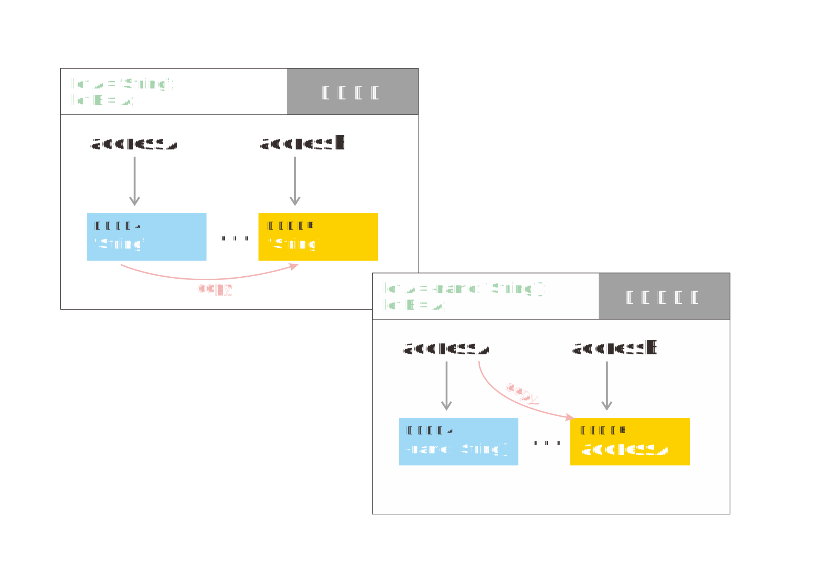

**函数内部对按值传入的参数进行修改，不会对外部参数有影响；**

**对按引用传入的参数修改（如传入的对象），会影响外部参数本身.**

具体原因是：

外部变量在内存中对应一个地址，这个地址指向的一段内存空间记载着这个外部变量的具体值。

函数的参数位于内存中的另一个不同的地址，在函数调用时，函数接收传来的外部变量，实际上是沿着外部变量的内存地址，找到内存中储存的值，然后复制一份到函数参数地址所指向的内存空间。这样，之后沿着函数参数在内存中的地址，去内存中寻找，也会找到与外部变量相同的值。

但是这二者是有区别的，函数内部始终访问、修改的是函数参数所在的内存中的值，而与外部变量无关。

那么，为什么按引用传入的参数（比如给函数传入对象类型的参数），在函数内部的修改会直接反应到函数外呢？

因为按引用传入的参数在赋值的时候，并不如上述复制内存中的实际值。而是直接把内存地址本身作为值储存起来。比如，a是一个对象，当执行let b = a；语句时，b的内存空间储存的是a的内存地址，而不是a的复制。

所以，传入对象作为函数参数，在函数内部使用.或[]访问具体的属性时，函数内外都引用的是一个内存空间中的同一对象，当然会直接反应在函数外部啦。
