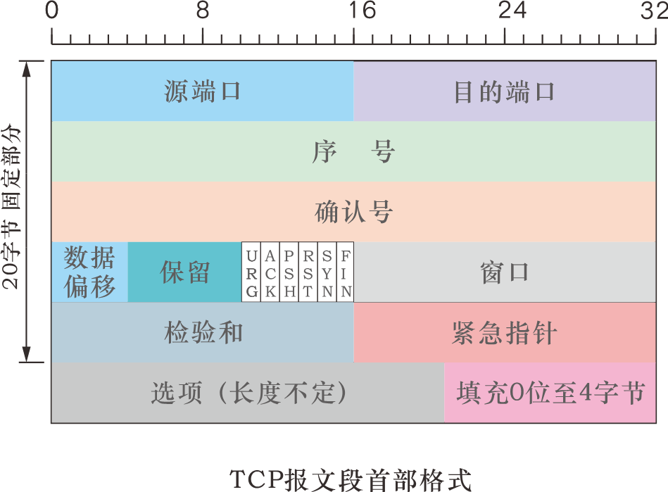

> 计算机网络笔记复习：TCP和HTTP，面试容易考。

# 1. TCP协议

## 1.1 TCP报文

TCP协议的首部由20字节的固定部分和4n字节的可变部分构成。其固定部分组成结构如下：

### 源端口、目标端口（各16位）
注明数据来源和目标的端口号。
###	序号（32位）
在TCP传输中，每一个字节都按顺序被标上序号。整个字节流的传输起始序号在TCP连接建立握手时设置。
TCP报文首部的序号，表示这个报文段第一个字节的序号。
###	确认号（32位）
是对方期望接收的下一个报文段第一个字节的序号。
确认号是接收方返回报文的重要内容。如果返回的确认号是N，则代表N-1之前的（包括N-1）序号的字节都已经被正确接收。
###	数据偏移（4位）
指出TCP报文中，数据起始位置距离报文起点有多远。（实际上就是指出了报文首部的长度。）
单位是4字节（32位）。也就是说，数据偏移如果是5，则代表数据第一个字节在距离起始点20字节位置处。
4位二进制数最大能表示的数字是15，因此 TCP报文首部最大长度为60字节，也就是说选项部分长度不能超过40字节。
###	保留（6位）
暂时无用。应该全部置0.
###	紧急标志URG（1位）
URG置1，则代表该报文段数据是紧急数据。
紧急数据会被TCP插入本报文段数据的最前面，而不是在后面排队。
###	确认标志ACK（1位）
确认标志ACK=1时，确认号字段才是有效的。
TCP规定，在连接建立之后，所有报文段都必须将ACK置1.
###	推送标志PSH（1位）
如果希望对方在收到报文后立即响应，可以将PSH置1.
PSH=1时，表示推送信息，对方在收到后将不再等待TCP缓存填满才上传给应用层，而是直接上传立即更新信息。
###	复位RST（1位）
RST=1时，表示TCP连接出现严重差错，必须释放然后重新建立连接。
RST=1还用来拒绝一个非法的报文段或拒绝打开一个连接。
###	同步标志SYN（1位）
用于在TCP连接建立时同步序号。SYN为1代表请求建立连接。
当SYHN=1、ACK=0，表示这是一个请求连接的报文段。当SYN=1、ACK=1时表示这是一个同意建立连接的响应报文。
###	终止标志FIN（1位）
用来释放一个连接。FIN=1表示数据已经发送完毕，请求释放一个连接。
###	窗口（16位）
指的是发送本报文一端的接收窗口大小。
单位是1字节。
如果接收的窗口字段为80，则代表如下含义： 对方缓存中还有80字节的空位，可以向它再传80字节的数据。
窗口值是发送方设置发送窗口大小的重要依据。（不能大于接收方的接收窗口大小）
###	检验和（16位）
检验和检验的范围包含首部和数据两部分。
检验和的计算与UDP一样，需要加一个伪首部。
###	紧急指针（16位）
紧急指针只有在URG=1时才有意义。它指出了紧急数据末尾在报文段中的位置。
通过它可计算本报文数据中的紧急数据的长度。紧急数据之后就还是普通数据。
###	选项（位数可变）
最长为40字节。如果使用后没凑满4字节的整数倍，则必须用填充0凑够4字节。
最初只有一种功能： 配置最大报文段长度MSS。（MSS代表每个TCP报文段中的数据部分的最大长度。）
默认情况下，如果没有配置MSS值，则MSS=536字节。
因此，所有互联网上的主机都必须能接受536+20=556字节的TCP报文段。
后来又加入了窗口扩大、时间戳和选择确认选项。 

## 1.2 TCP协议如何实现可靠传输

###	发送窗口

发送窗口是发送数据流中的一段，有一个前沿和一个后沿。前沿是能发送的最远的数据位置，后沿是发送且已确认的最大序号字节位置。前后沿之间的字节位置就是发送窗口。

发送窗口表示：在没有收到接收端确认的情况下，发送方可以将发送窗口中的全部数据都发送给对方。凡是没有收到对方确认的数据都必须暂时保留，以便在超时传送中重用。

随着接收端确认信息的收到和窗口字段数的改变，发送窗口动态改变。已确认发送成功的字节发送端可丢弃，同时发送窗口后沿向前移动。

>发送窗口的后沿只能向前移动或不动，不能向后移动。（已确认发送成功的信息不能撤回）
>
>发送窗口的前沿根据接收窗口的大小和确认号可以向前或不动，也可以向后移动（但是TCP协议一般非常不建议这样做。）
>
>发送窗口并不时刻保持与接收窗口一样大。因为网络时延和拥塞情况，发送窗口一般小于接收窗口。

### 接收窗口

接收窗口位于接收端，也有前沿和后沿。

接收窗口后沿取决于已返回确认的最大字节序号。前沿取决于接收端TCP缓存的大小。

## 1.3 TCP连接的建立与释放

### 建立链接：三次握手

TCP连接建立的过程叫做握手。需要在客户和服务器之间进行三次握手才能建立TCP连接。

#### ① 请求连接握手

请求方发出连接请求报文段。

**置SYN=1，ACK=0，同时给出序号seq=x;**

#### ② 同意建立连接确认

连接被请求方对TCP连接请求给出确认。

**置SYN=1，ACK=1，同时给出序号seq=y和确认号ack=x+1；**

#### ③ 请求方再次给出确认

请求方对被请求方给出的确认，再次进行确认。（防止“已失效的连接请求报文段”问题，见P239）

**置SYN=0、ACK=1，同时seq=x+1，ack=y+1.**

